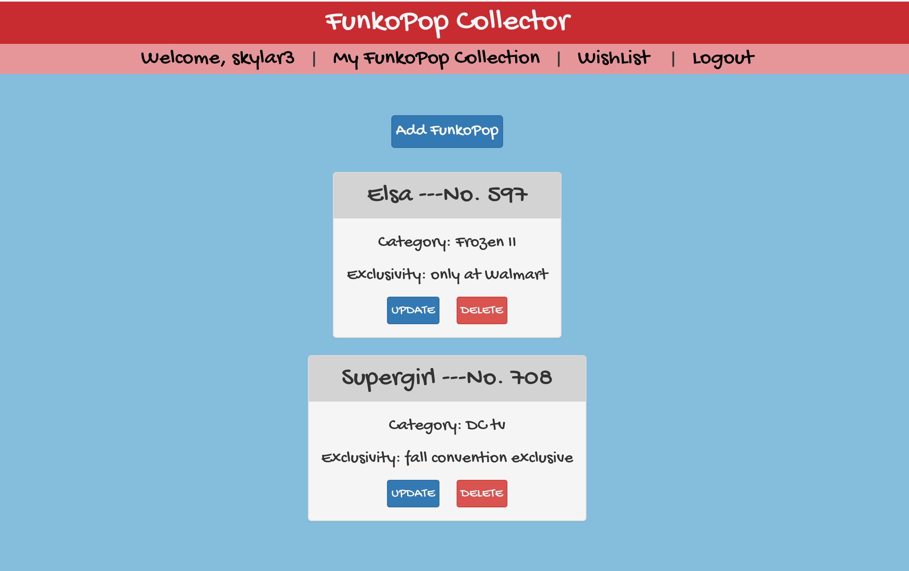

# FunkoPop Collector

## Introduction:
FunkoPop vinyl figurines, with large heads and small bodies, have continued to rise in popularity. As collectors continue to expand their vault of FunkoPops, an app is necessary to track all of them!

## Check out the App:
[Check out FunkoPop Collector](https://funkopop-collector.herokuapp.com/) 

[Trello](https://trello.com/b/4sS3YLW6/funkopop-collector) 

## View of the App:

## Technologies Implemented:
JavaScript, CSS, HTML, Node.js, Express, MongoDB/Mongoose, React, Bootstrap

## Credits:
- Font - Google Fonts Gochi Hand
- Chajr - David Stinson https://github.com/DavidStinson/chajr

# User Experience:
## User Persona #1:
Although pretending otherwise, David is obsessed with FunkoPops - he has a secret collection of them in his underground vault. He is desperately trying to maintain a cool and aloof persona and can't let his dog see him constantly wander into the vault. David therefore needs a discrete way to track his collection. Luckily, he has stumbled upon the FunkoPop Collector webapp!

## Next Steps:
- Add personal profile page
- ~~Add wishlist page~~
- ~~Allow movement of items from wishlist page to collection page~~
- Add search functionality
- Create categories to sort/filter collection